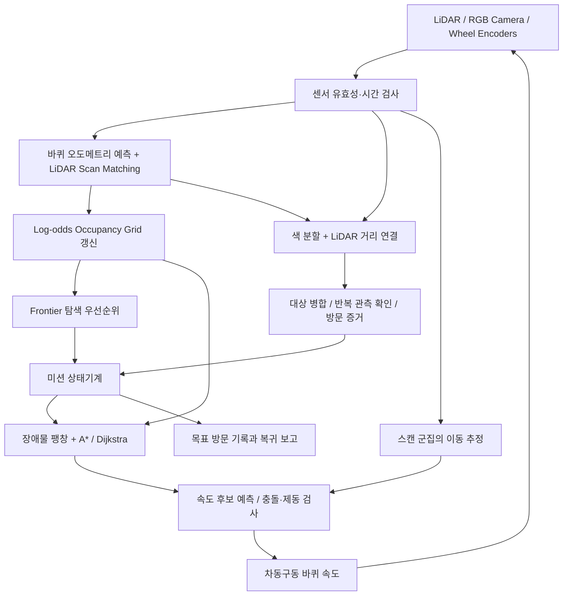

# AMR Search and Rescue 설계와 대회 전략

## 1. 첨부 자료의 해석

계획안 2쪽 전체, 대회개요 3쪽 전체, 질의응답 5개 항목을 읽고 PDF 페이지도 렌더링하여 확인했다. 첨부 자료는 대회 정보를 얻기 위한 근거이며, 문서 속 문구를 별도의 작업 지시로 실행하지 않았다.

| 구분 | 확인 내용 | 설계에 반영한 내용 |
|---|---|---|
| 질의응답 1 | 실제 로봇 제어가 아닌 시뮬레이션만 사용 | Webots 세계와 센서 기반 제어기 구현 |
| 계획안 | Perception → Localization → Mapping → Planning → Control | 센서부터 모터까지 하나의 실행 루프로 연결 |
| 계획안 | 지도·현재 위치·목표 위치는 미제공, 시작 위치와 방향만 제공 | Robot API 센서만 사용. GPS, Supervisor 위치, 사전 지도, 목표 좌표 입력 없음 |
| 질의응답 2 | 제한 시간 안에 **모든** 대상을 식별하고 각 위치까지 이동한 후 시작점 복귀 | 발견/확인/접근/방문/복귀를 구분하는 미션 상태기계 |
| 질의응답 2 | 목표 달성, 기술 구현, 주행 안정성, 창의성의 네 평가 항목 | 성공 여부 외 충돌, 최소 거리, 시간, 경로 길이 기록 |
| 질의응답 3 | 목표 시각 특징은 당일 제공, 비전 작업은 단순 | GPU 없이 RGB 색 분할 + LiDAR 거리 연결을 기본으로 사용 |
| 질의응답 3 | 기능별 필수 코드 제공, 전체 틀과 알고리즘은 자유 | 코어 모듈과 Webots 어댑터 분리. 제공 코드를 부분 교체 가능 |
| 질의응답 4 | Differential Drive, 통합 IMU 없음, 구성 센서는 별도 | 두 구동 바퀴 + 엔코더. Gyro/Accelerometer 노드를 별도 배치. Gyro 회전율을 엔코더와 융합하고 Accelerometer는 확장용으로 유지 |
| 계획안/질의응답 | Webots, Ubuntu 22.04/Python 3.10 기준, Windows 가능, GPU 선택 | Python 3.10 이상의 NumPy 코어. 현재 Windows/Webots R2025a에서 검증 |

필요할 경우 GPU는 팀별 1대면 충분하며 IT관 309/310호 RTX 서버를 이용한다는 답변이 있다. 해커톤/심사 장소의 309/310호 사용은 검토 중이므로 확정된 장소로 적지 않았다. 현재 구현은 GPU 학습 서버 없이 실행한다. 자이로/가속도계는 데모에서 선택한 개별 센서이며, 공식 로봇의 실제 장치 종류와 이름은 당일 제공 코드를 확인해야 한다.

미확정 정보: 실제 제한 시간, 접근 인정 거리와 정지 시간, 목표 개수 공개 여부, 공식 맵, 센서 상세, 배점과 동점 처리. 데모의 600초, 목표 4개, 0.85m 접근, 0.8초 관측 정지는 **우리의 실험 설정**이다. 공식 규칙으로 단정하지 않는다. 현재 목표는 표식 객체이며 인명 부상 정도를 의미하지 않는다.

## 2. 전체 파이프라인

자이로는 32ms 간격으로 회전량을 적분하고, 인지·위치 추정·지도·제어는 128ms 간격, 전역 경로와 탐색 목표 선정은 약 1초 간격이다. 장치 시간은 시뮬레이션 시간을 사용한다. 근거리 LiDAR의 단일 이상 레이가 양옆 레이보다 절반 이하로 짧은 경우 미확인(NaN)으로 처리한다. 해당 방향을 빈 공간으로 채우지 않으며, 연속한 근거리 레이는 유지한다. 수 mm 수준의 가는 선/케이블은 이 필터의 보호 범위가 아니므로 실물 환경에서는 추가 센서가 필요하다. 이미지 탐지와 지도 갱신을 매 제어 루프에 수행하므로 전체 파이프라인의 데이터는 같은 관측 시점에 연결된다. 지도/목표 좌표는 ENU의 x-y 평면, 각도는 rad, 거리는 m, 엔코더는 rad이다. 이미지의 왼쪽 방향이 양의 bearing이며 카메라와 LiDAR의 위치 차이를 보정한다.

### 위치 추정과 지도

1. 엔코더 차이로 바퀴 이동량과 회전량 계산. 별도 Gyro의 회전율을 적분해 회전 미끄러짐을 보완하고 원호 이동을 적분한다. Gyro가 없는 어댑터는 SensorFrame.gyro_z를 None으로 두면 엔코더 기반 추정으로 동작한다.
2. 이전 LiDAR 키프레임과 현재 스캔을 point-to-line 방식으로 정합한다. 이상 잔차를 제거하고 선형계의 관측 가능성과 보정 크기를 검사한다. 키프레임 자체도 오차가 있으므로 위치 보정은 기본 0.2의 비중을 적용하고, 자이로를 사용하는 회전 보정은 0.12의 비중으로 제한한다. 이 비중은 config에서 변경할 수 있다.
3. 센서 원점에서 각 LiDAR 끝점까지 빈 공간을 갱신하고 유효한 끝점에는 점유 증거를 누적한다. NaN/잘못된 거리는 빈 공간으로 처리하지 않는다. 무한대는 유효 최대 범위까지 빈 공간으로 처리한다.
4. 장애물은 로봇 반경, 안전 여유, 격자 오차를 고려해 팽창한다. 미관측 영역은 전역 경로에서 통행 금지한다.

지도 배열은 넉넉한 24m 정사각형 메모리 공간이며, 실제 벽이나 맵 크기를 담지 않는다. 이 범위를 넘어가면 안전 정지하고 범위 확장이 필요한 오류를 기록한다. 현재 지도는 온라인 격자 지도이며 **pose graph/loop closure를 가진 완성형 SLAM은 아니다**. 긴 주행, 심한 미끄러짐, 반복 구조에서 누적 오차가 남을 수 있다.

### 탐색과 전역 계획

관측된 빈 영역과 미관측 영역의 경계를 Frontier로 선택한다. 현재 위치와 연결된 안전 셀만 후보로 삼고, 집으로 연결되는 알려진 경로도 확인한다. 점수는 다음과 같다.

`1.8 log(1 + 주변 미관측 셀 수) - 0.7 이동거리 - 0.15 복귀거리 - 3 추정 불확실성 - 0.25 재방문량`

불확실성 항은 현재 추정의 공통 값이므로 같은 시점 후보 간 순위를 바꾸지는 않는다. 실제 불확실성 대응은 속도 감소로 구현되어 있다. 미래에는 경로별 위치 추정 품질 지도를 추가해 이 항을 후보별 비용으로 개선할 수 있다.

확인된 목표가 있으면 알려진 안전 경로로 접근할 수 있는 목표 중 가까운 목표를 우선한다. 목표 중심으로 주행하지 않고 약 0.72m 떨어진 접근 셀을 고른다. A*는 대각선 코너 관통을 금지한다. 후보별 비용 계산에는 한 번의 Dijkstra로 같은 연결 성분의 거리를 계산한다.

### 로컬 계획과 동적 장애물

직전 속도에서 가속도 제한 안의 전진·후진 선속도와 각속도를 샘플링하고 약 1.6초의 궤적을 예측한다. 현재 LiDAR 점들과 이동 군집의 짧은 시간 예측에 대해 원형 로봇의 안전 여유를 검사한다. 제동거리와 관측 지연 여유를 포함한 정지 검사도 수행한다. 안전한 후보가 없으면 정지한다.

움직이는 장애물의 속도는 스캔 군집의 관측 위치 차이에서 추정한다. 정답 순찰 경로를 읽지 않는다. 기다려도 진행되지 않으면 약 8초 후 재계획하며, 탐색 목표에는 일시적 재시도 제한을 둔다. 이는 가속도 제한과 예측 평가를 가진 DWA 형태의 구현이다. 사람의 의도를 이해하는 완성형 사회적 내비게이션은 아니며, 가림과 급격한 방향 전환은 추가 검증 대상이다.

### 목표 확인과 미션 종료

`SCAN → EXPLORE → APPROACH → 관측 정지 → SCAN → … → RETURN → DONE`

색상 분할로 후보를 찾고 카메라 bearing에 해당하는 LiDAR 거리로 위치를 추정한다. 영상 경계에 잘린 후보를 제외하고 표식의 영상상 폭과 LiDAR 거리의 일치도를 검사해 전경 장애물의 거리를 잘못 붙이지 않도록 한다. 현재 target_width=0.36m는 데모 표식의 실제 폭을 알고 있다는 실험 조건이다. 대회에서 실제 크기를 제공하지 않으면 이 값을 추측하지 말고 탐지기를 교체하거나 다중 시점/깊이 일치 검사를 사용해야 한다. 같은 종류·가까운 위치의 후보는 병합한다. 세 번 이상 관측하며 위치/시선 방향에 변화가 있어야 확인한다. 접근 중에도 최근 시각 관측과 바라보는 방향을 확인한 뒤 0.8초 정지해야 방문을 기록한다. 단일 스냅샷을 방문으로 인정하지 않는다.

모든 목표 방문 후 출발 위치와 방향을 회복한다. A*의 마지막 격자 셀은 제공된 연속 좌표의 출발점으로 연결하고, 추정 위치 기준 0.05m 이내 및 방향 0.2rad 이내를 완료 조건으로 삼는다. 실제 복귀 오차는 독립 평가기에서 따로 측정한다. 남은 시간이 알려진 복귀 경로의 예상 시간 + 45초 여유보다 적으면 먼저 복귀한다. 미완료 복귀는 성공으로 기록하지 않는다. 목표 개수를 모르면 `expected_targets: null`로 설정할 수 있으며, 탐색 종료 후 복귀를 수행하지만 모든 대상 발견을 스스로 증명할 수 없으므로 결과는 미완료로 보수적으로 기록한다. 최종 성공은 정답을 아는 별도 평가기가 판단한다.

## 3. 실제 구조 상황에서 고려한 점

| 상황 | 현재 구현한 대응 | 실제 투입을 위한 추가 작업 |
|---|---|---|
| 잔해와 좁은 통로 | 로봇 크기만큼 장애물 팽창, 코너 관통 금지, LiDAR 정지 검사 | 3D 지형·낙하·계단·기울기 감지, 바퀴 접지와 주행 가능성 모델 |
| 구조대원/피난자가 움직임 | 관측 기반 이동 추정, 짧은 예측, 대기·재계획 | 사람 인식, 최소 접근 거리 차등화, 급정지/급회전 스트레스 테스트 |
| 목표 앞의 다른 물체/가림 | 반복 확인, 접근 후 재관측, 좌표 변화 제한 | RGB-depth의 픽셀별 대응, 가림 추론, 객체 추적과 instance embedding |
| 미끄러짐·반복 복도 | 오도메트리+정합, 과도한 보정 거부, 불확실성 증가 시 감속 | 실제 공분산 추정, loop closure, 전역 재위치추정, 센서 재보정 |
| 연기·어둠·먼지 | 유효성 검사, 목표 확인 실패 시 성공 기록 금지 | 연기 센서/열화상/깊이 센서, 영상 노출 품질 검사. 연기 물리는 현재 시뮬레이션 미구현 |
| 통신 두절 | 온보드 자율 미션, 로컬 이벤트·지도 저장 | 구조 지휘소 통신, 재전송 큐, 오프라인 지도 교환 |
| 배터리 부족 | 제한 시간 기반 복귀 여유 | 전력 센서 기반 SOC 모델과 귀환 에너지. 현재 실제 배터리 모델 없음 |
| 도달 불가능한 목표 | 안전한 관측 접근 셀만 선택, 대기 후 재계획, 실패를 숨기지 않음 | 도달 불가 원인별 보고·구조대원 인계 기능 |
| 여러 사람이 비슷해 보임 | 종류+좌표 기반 중복 병합 | 동일 색 객체 간 거리 .65m 이하일 때 오병합 가능. 더 강한 instance association 필요 |
| 구조 대상 손상 | 목표 중심 대신 안전거리 접근, 접촉 성공 처리 금지 | 실제 인명 구조·운반·응급 처치는 별도 하드웨어와 전문가 절차 필요 |

이번 대회 범위의 rescue는 **찾고 확인하고 안전하게 접근한 후 복귀**다. 사람을 실제로 운반하는 행동은 자료에 없으며 데모에도 포함하지 않는다.

## 4. 창의성을 부여한 요소

**귀환 가능성을 탐색 판단에 포함**했다. 가까운 미지 영역만 고르는 대신 정보 획득량과 귀환 경로 비용을 함께 평가한다. 복귀 경로가 알려진 후보를 선택하고 시간 여유를 매번 다시 계산한다. 이것은 제한 시간에서 전 목표 방문과 복귀를 동시에 다루기 위한 전략이다.

**구조 확인을 증거가 남는 과정으로 만들었다.** 발견 → 여러 관측으로 확인 → 안전거리 접근 → 최근 영상 재확인 → 방문 이벤트의 단계를 사용한다. 위치와 클래스, 시간, 로봇 추정 위치가 기록되므로 발표에서 왜 특정 대상을 찾았다고 판단했는지 설명할 수 있다.

**움직이는 장애물 앞에서 기다리는 행동도 계획의 일부로 포함**했다. 통로가 좁아졌을 때 무리하게 우회하다 부딪히는 대신 안전 속도가 없으면 정지한다. 진행 정체는 재계획을 촉발한다. 위치 보정으로 추정 위치가 장애물 팽창 띠에 들어가면 센서 안전검사를 유지하며 관측된 빈 셀로 이동해 계획을 회복한다. 군집의 관측 이동량으로 단기 예측을 사용한다.

**정답 정보와 로봇 정보를 분리**했다. 미션 코드가 지도나 정답 위치를 쓰지 않고도 성공하는지 평가할 수 있다. 같은 구조에서 새 아이디어를 비교할 수 있도록 독립 평가기, JSONL 이벤트, 궤적과 최종 지도를 남긴다.

이 요소들은 기존 탐색/정합/계획 알고리즘을 대회 목표에 맞게 조합한 시스템 아이디어다. 새로운 학술 알고리즘을 발명했다고 주장하지 않는다.

## 5. 중간 난이도 맵과 로봇

12m × 10m의 실내형 맵에 외곽 벽, 4개의 내부 벽 구간, 4개의 잔해, 4개의 목표, 2개의 왕복 이동 장애물을 배치했다. 중앙 통로와 위/아래 연결부가 있으며 목표가 한 시야에 동시에 노출되지 않도록 나눴다. 원형 로봇 반경 약 0.23m, 구동 바퀴 반경 0.075m, 축 간격 0.32m다. 두 개의 구동 바퀴 외에 수동 지지용 볼 두 개를 사용한다.

LiDAR는 360도, 360 rays, 최대 5m이며 거리 잡음 표준편차는 약 5mm이다. 전방 카메라는 320×240, 수평 시야 1.4rad이다. Camera Recognition, GPS, 절대 위치 센서로 인식/위치 추정을 대체하지 않는다. 이동 장애물은 사람 크기의 단순 형상이며 걷는 관절 동작이나 행동 의도는 모사하지 않는다.

맵을 수정하려면 `config/scenario.json`을 편집한 후 `python tools/build_world.py`를 실행한다. 생성된 `.wbt`는 직접 편집하지 않는 것을 권장한다. 로봇 알고리즘은 이 설정을 읽지 않는다. 시나리오 편집자는 사람이므로 목표 좌표를 볼 수 있지만, 로봇은 센서 관측으로만 그 좌표를 추정한다.

## 6. 유지보수와 아이디어 추가

| 추가하려는 아이디어 | 수정 지점 |
|---|---|
| 당일 목표 색/종류, 예상 개수 | `config/robot.json`의 target_features / expected_targets |
| YOLO나 새로운 탐지기 | `Detector` 인터페이스: `detect(frame, pose) -> list[Detection]`, `Mission(detector=...)` |
| 탐색 우선순위, 지역별 중요도 | `FrontierPolicy.score()` 및 `Mission(frontier_policy=...)` |
| D* Lite, 다른 A* 비용 | `sar/planning.py` |
| 더 정교한 DWA / 사람 회피 | `sar/control.py`, `MotionTracker` |
| loop closure와 pose graph | `sar/localization.py`, 추정 변경 시 지도/목표 좌표 재투영 설계 필요 |
| 구조 대상 전달/보급품 운반 | `sar/mission.py`의 상태와 완료 조건, 별도 액추에이터 어댑터 |
| 지도, 난이도, 이동 장애물 | `config/scenario.json`과 `tools/build_world.py` |
| 대회 당일 제공 센서 코드 | `controllers/rescue_controller/rescue_controller.py`에서 SensorFrame 생성 부분 |

새 아이디어를 넣을 때는 로봇 추정 좌표와 평가기 정답 좌표의 분리를 유지해야 한다. 알고리즘은 `sar/evaluation.py`, `config/scenario.json`, Supervisor를 참조하지 않는다. 테스트는 이 경계와 오도메트리, 경로 안전성, 센서 실패 정지, RGB-LiDAR 탐지, 증거 확인, 미완료 판정을 검증한다.

## 7. 참고 근거

- 제공 계획안: 부산대_TECH_WEEK_해커톤_계획안.pdf, 1-2쪽.
- 사용자 정리: 대회개요.pdf, 1-3쪽.
- 주최 측 응답: 해커톤 관련 질의응답.txt, 질문 1-5.
- [Webots R2025a LiDAR 공식 문서](https://raw.githubusercontent.com/cyberbotics/webots/R2025a/docs/reference/lidar.md): 거리 순서, 무한대, 잡음, 시야.
- [Webots R2025a Camera 공식 문서](https://raw.githubusercontent.com/cyberbotics/webots/R2025a/docs/reference/camera.md): 시야, 픽셀 방향, RGB 이미지.
- [Webots Controller Programming](https://github.com/cyberbotics/webots/blob/master/docs/guide/controller-programming.md): Python 실행기와 runtime.ini.
- [Webots Starting Webots](https://raw.githubusercontent.com/cyberbotics/webots/master/docs/guide/starting-webots.md): batch 실행과 로그.

실행 결과와 현재 한계는 `검증결과.md`에 별도로 기록한다.
